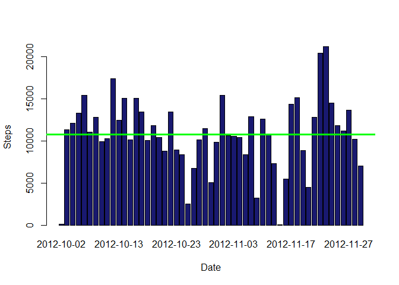
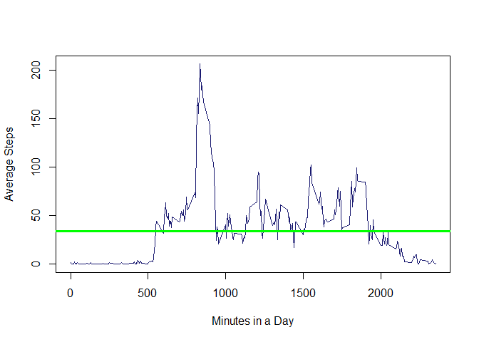
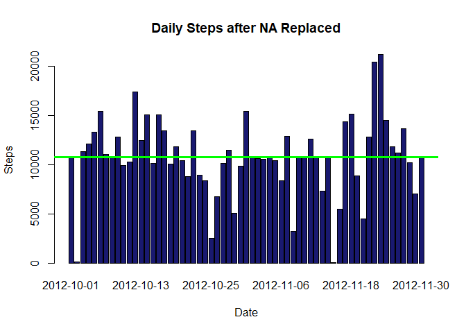
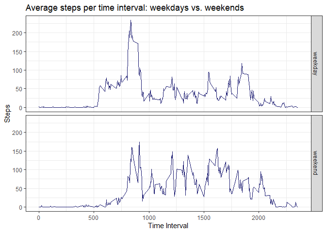

## Loading and preprocessing the data

Assume the activity.csv file is under the current working directory, if not, please download it from  [Activity monitoring data]( https://d396qusza40orc.cloudfront.net/repdata%2Fdata%2Factivity.zip), and place it under current working directory.  


```r
activity <- read.csv("activity.csv")

activity$date <- as.Date(activity$date, "%Y-%m-%d")
daily_steps <- aggregate(steps~date, activity, sum, na.rm = TRUE)
```

### Histogram of the total number of steps taken each day


```r
barplot( daily_steps$steps, names.arg= daily_steps$date, col = "midnightblue", xlab = 'Date', ylab = 'Steps')
abline(h=median(daily_steps$steps), col='green', lwd=3)
```

<!-- -->

## Mean and median number of steps taken each day


```r
mean(daily_steps$steps)
```

```
## [1] 10766.19
```

```r
median(daily_steps$steps)
```

```
## [1] 10765
```

```r
summary(daily_steps)
```

```
##       date                steps      
##  Min.   :2012-10-02   Min.   :   41  
##  1st Qu.:2012-10-16   1st Qu.: 8841  
##  Median :2012-10-29   Median :10765  
##  Mean   :2012-10-30   Mean   :10766  
##  3rd Qu.:2012-11-16   3rd Qu.:13294  
##  Max.   :2012-11-29   Max.   :21194
```

## What is the average daily activity pattern? 
### Time series plot of the average number of steps taken


```r
daily_activities <- with(activity, aggregate( steps ~ interval,FUN = mean, na.action=na.omit))
plot( x=daily_activities$interval,daily_activities$steps, type="l", col = 'midnightblue', xlab = 'Minutes in a Day', ylab = 'Average Steps')

abline(h=median(daily_activities$steps), col='green', lwd=3)
```

<!-- -->

### The 5-minute interval that, on average, contains the maximum number of steps


```r
library(dplyr)

max_activity <- daily_activities %>% filter(steps==max(steps))
paste("Maximum interval mean steps is",max_activity$steps, " at interval ", max_activity$interval)
```

```
## [1] "Maximum interval mean steps is 206.169811320755  at interval  835"
```

## Imputing missing values

### Calculate and report the total number of missing values in the dataset 


```r
na_activities <- subset(activity, is.na(steps))
total_na <- length(na_activities$steps)
paste("Total missing values: ", total_na)
```

```
## [1] "Total missing values:  2304"
```

### Code to describe and show a strategy for imputing missing data
replace each NA value by steps mean per interval


```r
merged_activities <- merge(activity, daily_activities, by = 'interval')
merged_activities <- transform(merged_activities, steps.x = ifelse(is.na(steps.x),steps.y, steps.x))
merged_activities <- subset(merged_activities, select = -c(steps.y))
names(merged_activities)[names(merged_activities)=='steps.x'] <- "steps"
```

### Make a histogram of the total number of steps taken each day


```r
filled_na_activities <- with(merged_activities, aggregate(steps~date,FUN = sum, na.action=na.omit))
with(filled_na_activities, barplot( steps, names.arg=date, col = "midnightblue", xlab = 'Date', ylab = 'Steps', main = 'Daily Steps after NA Replaced'))
abline(h=median(filled_na_activities$steps), col='green', lwd=3)
```

<!-- -->


### Calculate and report the mean and median total number of steps taken per day.


```r
mean(filled_na_activities$steps)
```

```
## [1] 10766.19
```

```r
median(filled_na_activities$steps)
```

```
## [1] 10766.19
```

```r
summary(filled_na_activities)
```

```
##       date                steps      
##  Min.   :2012-10-01   Min.   :   41  
##  1st Qu.:2012-10-16   1st Qu.: 9819  
##  Median :2012-10-31   Median :10766  
##  Mean   :2012-10-31   Mean   :10766  
##  3rd Qu.:2012-11-15   3rd Qu.:12811  
##  Max.   :2012-11-30   Max.   :21194
```

### Do these values differ from the estimates from the first part of the assignment? What is the impact of imputing missing data on the estimates of the total daily number of steps?

Because the NAs were replaced with interval means, the total, mean, median of steps are more than NA removed.


## Are there differences in activity patterns between weekdays and weekends?
### Panel plot comparing the average number of steps taken per 5-minute interval across weekdays and weekends


```r
library(ggplot2)

activity <- mutate(activity, weekday = weekdays(activity$date))
activity$DayType <- ifelse(activity$weekday=='Saturday' | activity$weekday=='Sunday', 'weekend','weekday')
weekly_activities_steps <- with(activity, aggregate( steps ~ interval+DayType,FUN = mean, na.action=na.omit))

gg=ggplot(weekly_activities_steps, aes(interval, steps))
gg= gg+geom_line(col="midnightblue")
gg=gg+facet_grid(DayType ~ .)
gg = gg + ggtitle("Average steps per time interval: weekdays vs. weekends") + xlab("Time Interval")+ ylab("Steps")
gg = gg+ theme_bw()
print(gg)
```

<!-- -->


